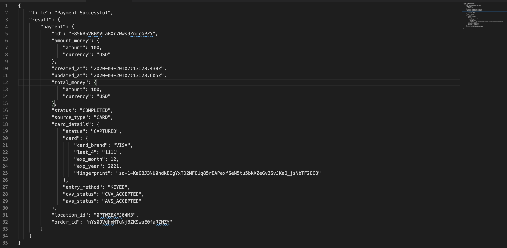

# Welcome

This project is meant to serve as an educational reference for getting started processing credit card payments with Square.

The original project was based on the [walkthrough](https://developer.squareup.com/docs/payment-form/payment-form-walkthrough) at [https://developer.squareup.com/docs/payment-form/payment-form-walkthrough](https://developer.squareup.com/docs/payment-form/payment-form-walkthrough)

## Screenshots

After completing step 1 in its entirety, here is a screenshot of a successful nonce response being received by the browser:

After notating comments in the server for step 2, here is a screenshot of being able to successfully process and capture a credit card payment:

Here is a screenshot of the JSON response:

